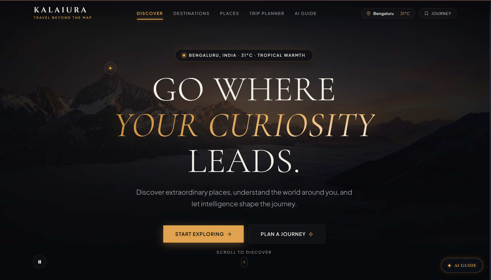
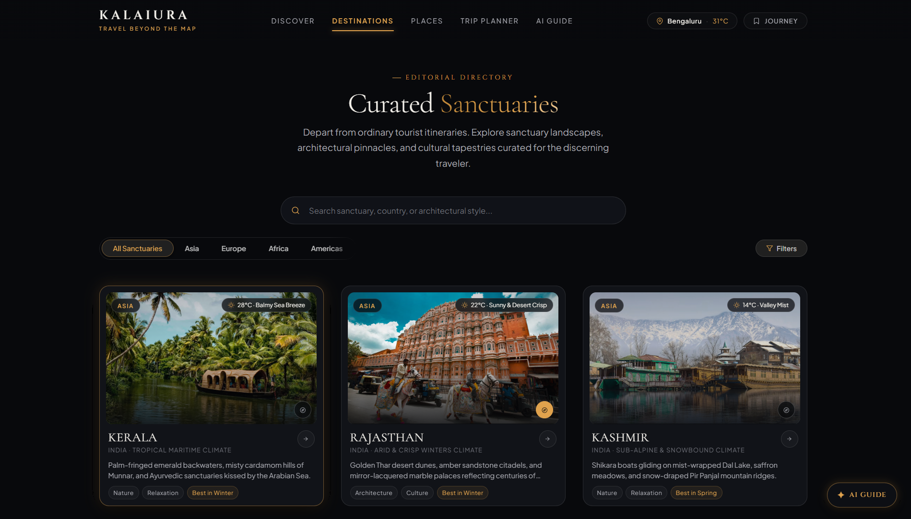
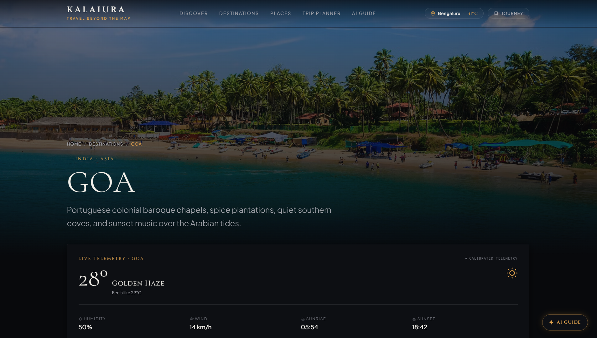
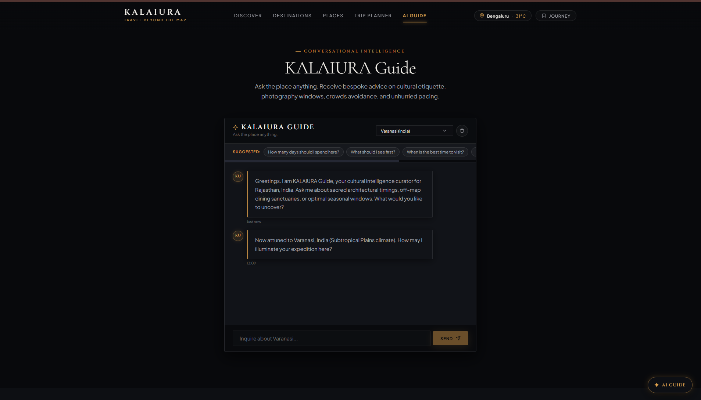
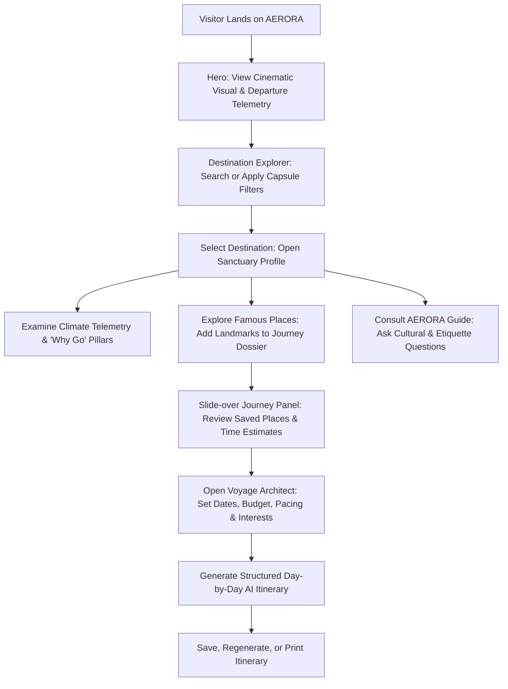

# AERORA — Travel Beyond the Map

[](https://react.dev/)
[](https://reactrouter.com/)
[](https://vitejs.dev/)
[](https://developer.mozilla.org/en-US/docs/Web/CSS)
[](https://developer.mozilla.org/en-US/docs/Web/JavaScript)

AERORA is an immersive, editorial travel discovery platform and intelligent journey planner designed for discerning travelers. Built with pure React, custom CSS tokens, and semantic HTML5, the application allows users to discover hand-curated sanctuary destinations across five continents, explore architectural landmarks, monitor live real-time climate telemetry, converse with an intelligent cultural guide, and synthesize bespoke day-by-day itineraries tailored to their pace and travel style.

[Live Demo](YOUR_DEPLOYED_URL) · [GitHub Repository](https://github.com/KalaiarasanE/Kalaiura-Travel-app)

---

## Project Preview

<!-- Replace these image paths with the final screenshots included in the repository. -->










> **Note**: Replace these image paths with the final screenshots included in the repository.

---

## Overview

AERORA was designed as a premium, editorial travel publication brought to life as an interactive web application. Rather than resembling a transactional, cluttered booking marketplace or generic SaaS dashboard, the interface adopts the atmosphere of luxury travel volumes, characterized by:

- **Strong Visual Hierarchy**: Clear, intentional typographic relationships anchored by high-contrast serif headlines and clean grotesque sans-serif metadata.
- **Cinematic Imagery**: Full-bleed hero visuals and rich architectural photography integrated with deep dark vignettes.
- **Editorial Typography**: Pairing classical serif typefaces (`Cormorant Garamond`, `Cinzel`) with modern, legible grotesques (`Plus Jakarta Sans`).
- **Intentional Motion**: Restrained, purpose-driven animations including text gradient shifts, staggered card entrances, and smooth hover micro-interactions.
- **Responsive Layouts**: Asymmetrical desktop grids that adapt fluidly to tablet viewports and thumb-friendly mobile layouts without horizontal overflow.
- **Accessible Interactions**: Standard semantic elements, ARIA attributes, visible focus indicators, and keyboard-operable modals and drawers.
- **Clear State Handling**: Dedicated skeleton loaders, graceful offline fallbacks, and humanized empty and error states.
- **AI-Assisted Trip Planning**: Parametric day-by-day voyage architecture with automated expense estimation and instant export.

---

## Key Features

### Destination Discovery
- **Editorial Catalogue**: Browse curated world sanctuaries (Kyoto, Santorini, Reykjavik, Cape Town, Udaipur, Lisbon, Bali, and the Swiss Alps).
- **Multi-Parameter Filtering**: Instant filtering by geographic region, climatic zone (Temperate, Mediterranean, Subpolar, Oceanic, etc.), travel style, budget tier, and best visiting season.
- **Real-Time Search**: Instant search matching sanctuary names, countries, and narrative descriptions.
- **Dedicated Sanctuary Profiles**: Deep-linked routes (`/destination/:id`) featuring narrative background, seasonal climate rhythm profiles, and cultural etiquette notes.

### Famous Places & Monuments
- **Curated Landmarks**: Deep-dive architectural profiles for historic landmarks with photography, categorization, and atmosphere.
- **Exploration Telemetry**: Precise recommended visit durations and optimal daily lighting windows (e.g., dawn vs. twilight).
- **Personal Journey Integration**: Direct one-click toggle to add or remove landmarks from the active travel dossier with live counter synchronization.

### Location Awareness
- **Browser Geolocation**: Direct integration with the browser Geolocation API to detect departure coordinates.
- **Manual City Override**: Searchable worldwide city directory with manual latitude/longitude mapping.
- **Permission Resilience**: Non-blocking permission handling with persistent local storage status and manual override fallback when denied.

### Real-Time Weather & Telemetry
- **Atmospheric Telemetry**: Current temperature, weather description, wind speeds, and humidity via OpenWeather API.
- **Calibrated Climate Engine**: Resilient fallback engine that provides climatologically accurate historical models if the API is offline or unkeyed.
- **Live Diurnal Indicators**: Dynamic solar telemetry chips integrated directly into navigation and destination cards.

### AI Travel Guide (“AERORA Guide”)
- **Conversational Concierge**: Context-aware assistant powered by Google Gemini with deep editorial knowledge fallbacks.
- **Destination Context Switching**: Attunes answers specifically to the active sanctuary.
- **Curated Question Chips**: Fast-access questions covering duration, first-day priorities, seasonality, and local etiquette.
- **Direct Place Recommendation Chips**: Clickable landmark pills within chat responses that can be saved directly to the user's journey.

### AI Itinerary Planner (“Voyage Architect”)
- **Parametric Voyage Generation**: Generates structured, day-by-day travel plans based on destination, target departure date, duration (1–10 days), travel style, budget, and cultural pace.
- **Dynamic Expense Estimation**: Live expense calculation broken down into lodging, fine dining, and cultural access.
- **Structured Timeline Rendering**: Clean chronological activity blocks with recommended times, milestones, and logistics tips.
- **Dossier Management**: Save itineraries to localStorage, regenerate variations on demand, and export/print formatted schedules.

### Responsive Design
- **Desktop**: Expansive asymmetric grids, sticky telemetry headers, and dual-column workspace layouts.
- **Tablet**: Balanced two-column card grids and collapsed drawer controls.
- **Mobile**: Seamless capsule scroll filters, touch-friendly buttons, slide-over navigation overlay, and strictly zero horizontal overflow.

### Accessibility
- **Semantic HTML5**: Native `<main>`, `<header>`, `<nav>`, `<section>`, `<article>`, and `<footer>` landmarks.
- **Keyboard Operability**: Full <kbd>Tab</kbd>, <kbd>Enter</kbd>, and <kbd>Escape</kbd> navigation for all interactive dialogs and slide-over drawers.
- **Visible Focus States**: Unobtrusive, high-contrast gold focus rings on all interactive controls.
- **Descriptive Alt Text**: Contextual descriptive alternative text on all meaningful destination and place imagery.

---

## Design Approach

The aesthetic foundation of AERORA combines the tactile elegance of a print publication with the dynamic responsiveness of modern web technology:

- **Near-Black Charcoal Palette**: A primary background of `#08090C`, secondary surfaces of `#0D0F13`, and elevated card panels of `#111318`, replacing harsh pure blacks and generic light themes.
- **Warm Champagne Gold**: Accent color `#E0A24D` used selectively to indicate interactive states, active filters, and key metadata without visual noise.
- **Generous Editorial Whitespace**: Ample vertical breathing room between narrative sections to prevent cognitive overload.
- **Asymmetric Grid Layouts**: Intentional grid variance for featured destinations, breaking the monotony of uniform card grids.
- **Soft Ambient Radiance**: Multi-stop radial gradients and gold glow accents that mimic natural gallery lighting.

---

## Technology Stack

| Technology | Purpose |
| :--- | :--- |
| **HTML5** | Semantic structure, accessibility landmarks, and native audio/video integration |
| **CSS3** | Bespoke design token system, CSS Grid, Flexbox, custom `@keyframes`, and responsive breakpoints |
| **JavaScript (ES6+)** | Modular logic, async service orchestration, and client-side data filtering |
| **React 19** | Component-based view layer and declarative DOM synchronization |
| **React Hooks** | Fine-grained state management (`useState`, `useEffect`, `useContext`, `useMemo`, `useRef`) |
| **React Router v7** | Client-side routing, URL parameter mapping (`/destination/:id`), and scroll management |
| **Vite 8** | Rapid development server, hot module replacement (HMR), and production asset bundling |

> **Constraint Compliance**: Built completely from scratch without Tailwind CSS, Bootstrap, Material UI, Next.js, TypeScript, or any external UI/component libraries.

---

## APIs & External Services

| Service | Integration Purpose | Fallback Mechanism |
| :--- | :--- | :--- |
| **OpenWeather API** | Live temperature, atmospheric condition, and wind telemetry | Mathematical climate model with historical seasonal averages |
| **Google Gemini API** | Natural language cultural guidance and day-by-day itinerary synthesis | Built-in editorial knowledge base and algorithmic timeline generator |
| **Unsplash API** | High-resolution landscape and architectural photography | Curated collection of high-resolution, CDN-backed editorial imagery |

*All API integrations access environment variables exclusively via `import.meta.env.*`. Secret keys are strictly excluded from version control.*

---

## Application Structure

```text
src/
├── components/           # Reusable presentational and container components
│   ├── AIGuide.jsx              # Conversational AI assistant interface
│   ├── BentoShowcase.jsx        # 4-pillar intelligence feature matrix
│   ├── ChatMessage.jsx          # Editorial chat bubbles with monogram avatars
│   ├── DestinationCard.jsx      # Prompt-card-hover destination grid component
│   ├── DestinationDetail.jsx    # Complete sanctuary profile view
│   ├── DestinationExplorer.jsx  # Search, capsule filter bar, and cards grid
│   ├── EditorialCTA.jsx         # Pre-footer banner with radial gold glow
│   ├── EditorialImage.jsx       # Resilient image loader with skeleton & error recovery
│   ├── FamousPlaces.jsx         # Architectural landmarks showcase
│   ├── Footer.jsx               # Editorial footer with standards modals
│   ├── Hero.jsx                 # Full-screen cinematic video hero with live pill
│   ├── Icons.jsx                # Handcrafted, accessible pure SVG icon library
│   ├── ItineraryBuilder.jsx     # Parametric voyage architect workspace
│   ├── ItineraryDay.jsx         # Day timeline node with milestone chips
│   ├── JourneyMap.jsx           # Stylized SVG transcontinental route cartography
│   ├── JourneyPanel.jsx         # Slide-over saved dossier & favorites drawer
│   ├── LoadingSkeleton.jsx      # Shimmer loading placeholders
│   ├── LocationSelector.jsx     # Manual departure coordinates modal
│   ├── Navbar.jsx               # Header with location chip and journey counter
│   ├── PlaceCard.jsx            # Landmark card with "Add to Journey" toggle
│   ├── StatsTicker.jsx          # Telemetry and curation ticker strip
│   ├── TravelerPerspectives.jsx # Editorial memoirs and traveler reflections
│   └── WeatherCard.jsx          # Detailed climate telemetry dashboard
├── context/              # Global application state providers
│   ├── JourneyContext.jsx       # User-saved landmarks, active destination, and itineraries
│   └── LocationContext.jsx      # Coordinates, active departure city, and weather synchronization
├── data/                 # Curated editorial datasets
│   ├── curatedRoutes.js         # Transcontinental waypoint arcs and coordinates
│   ├── destinations.js          # Complete sanctuary specifications, seasons, and narratives
│   └── places.js                # Famous architectural monuments, durations, and images
├── hooks/                # Custom React lifecycle hooks
│   ├── useLocation.js           # Safe accessor for global location and weather state
│   └── useWeather.js            # Asynchronous weather telemetry loader with error handling
├── pages/                # Route-level page views
│   ├── DestinationPage.jsx      # Dynamic /destination/:id sanctuary route
│   ├── Destinations.jsx         # Full destination discovery catalogue
│   ├── GuidePage.jsx            # Dedicated full-page AI concierge
│   ├── Home.jsx                 # Flagship landing page experience
│   ├── PlacesPage.jsx           # Global architectural monuments directory
│   └── Planner.jsx              # Dedicated Voyage Architect workspace
├── services/             # External network communications and fallback engines
│   ├── ai.js                    # Gemini API caller with fallback response synthesizer
│   ├── images.js                # Unsplash query resolution and curated photography
│   └── weather.js               # OpenWeather integration and climate model calculations
├── styles/               # Bespoke CSS architecture
│   ├── components.css           # Buttons, cards, modals, drawers, and keyframe animations
│   ├── global.css               # Reset, typography rules, and custom scrollbar
│   ├── responsive.css           # Breakpoint definitions from mobile (320px) to 1440px+
│   └── variables.css            # Canonical design system tokens (colors, fonts, radii)
├── App.jsx               # Top-level routing configuration and context wrappers
└── main.jsx              # React application DOM entry point
```

---

## User Flow



1. **Arrival**: The user experiences the cinematic video hero, observing live departure telemetry and seasonal weather for their location.
2. **Exploration**: The user filters destinations via the capsule navigation bar by region, climate, travel style, budget, or season.
3. **Deep Dive**: Navigating to a sanctuary profile reveals climate rhythms, insider local notes, and defining architectural landmarks.
4. **Curation**: The user adds landmark places to their personal journey, tracking accumulated exploration hours.
5. **Guidance**: Opening the AERORA Guide provides real-time cultural advice, suggested questions, and local customs.
6. **Synthesis**: In the Voyage Architect, the user inputs departure parameters and generates a day-by-day travel plan with expense breakdowns.

---

## Responsive Design

The application incorporates a mobile-first responsive strategy across three primary breakpoints:

- **Desktop ($\ge$ 1024px)**: Asymmetrical multi-column grids, dual-column workspace layouts, sticky telemetry sidebars, and generous spacing.
- **Tablet (768px – 1023px)**: Responsive two-column grids, collapsed controls, and adaptive modal dialogs.
- **Mobile (320px – 767px)**:
  - Horizontal swipeable capsule filter bars with gradient edge masks.
  - Dedicated full-screen mobile menu with smooth slide transitions.
  - Full-width touch-friendly tap targets ($\ge$ 44px height).
  - Single-column stacked layouts preventing horizontal overflow.

---

## Loading, Empty & Error States

- **Shimmer Skeletons**: Visual loading placeholders match the geometry of destination cards, weather widgets, and itinerary timelines during data fetching.
- **Graceful API Failures**: If OpenWeather or Gemini APIs are rate-limited or unreachable, fallback engines seamlessly supply climatological data and editorial responses without UI disruption.
- **Image Resilience**: The `EditorialImage` component manages lazy loading, displays a shimmer state until bytes are decoded, and falls back to category-specific curated imagery if an external image link fails.
- **Empty Filter Results**: Clear, humanized empty states provide instant one-click filter reset buttons when searches yield no matches.

---

## Accessibility

- **Semantic Landmark Roles**: Proper structural organization using `<header>`, `<nav>`, `<main>`, `<section>`, `<article>`, `<aside>`, and `<footer>`.
- **Keyboard Navigation**: Interactive elements receive logical tab order and visible high-contrast gold outline focus indicators.
- **Modal Dialog Traps**: Esc-key listeners and backdrop click handlers close modal dialogs and the slide-over journey drawer.
- **Accessible Buttons**: Icon-only buttons contain descriptive `aria-label` attributes for screen reader clarity.
- **WCAG Contrast**: Body text and accent colors maintain high contrast against dark surfaces.

---

## Security

- **Zero Hardcoded Secrets**: No API keys or tokens are stored within client source code.
- **Environment Variable Isolation**: Keys are read at build/runtime exclusively through Vite’s `import.meta.env.*` mechanism.
- **Git Hygiene**: Local `.env` and sensitive environment configurations are strictly listed in `.gitignore`.
- **Template Security**: A `.env.example` file is provided with sanitized placeholders to facilitate clean onboarding.

---

## Getting Started

### Prerequisites
- [Node.js](https://nodejs.org/) (version 18.0 or higher recommended)
- [npm](https://www.npmjs.com/) (version 9.0 or higher)

### Installation

1. Clone the repository:
   ```bash
   git clone https://github.com/KalaiarasanE/Kalaiura-Travel-app.git
   cd Kalaiura-Travel-app
   ```

2. Install dependencies:
   ```bash
   npm install
   ```


4. Start the local development server:
   ```bash
   npm run dev
   ```
   Open your browser and navigate to `http://localhost:5173`.

---

## Build for Production

To create an optimized production build:

```bash
npm run build
```

This compiles client assets into the `dist/` directory with code splitting, CSS minification, and tree shaking.

To preview the production build locally:

```bash
npm run preview
```

---

## Deployment

AERORA is optimized for static hosting platforms. Rewrite rules are pre-configured for Single Page Application (SPA) routing:

- **Vercel**: Pre-configured via `vercel.json` rewrite routing.
- **Netlify**: Pre-configured via `public/_redirects`.

Live Application: [YOUR_DEPLOYED_URL](YOUR_DEPLOYED_URL)

---

## Screenshots

| View | Path |
| :--- | :--- |
| **Cinematic Hero & Telemetry** | `./screenshots/home.png` |
| **Capsule Destination Explorer** | `./screenshots/destinations.png` |
| **Sanctuary Profile & Weather** | `./screenshots/destination-details.png` |
| **Conversational AI Concierge** | `./screenshots/ai-guide.png` |
| **Voyage Architect Workspace** | `./screenshots/itinerary.png` |
| **Mobile Navigation & Cards** | `./screenshots/mobile.png` |

---

## Project Highlights

- **Pure Component Architecture**: Zero UI library dependencies; every card, button, modal, drawer, and icon was built from scratch.
- **Bespoke CSS Token System**: Centralized design tokens for colors, typography scales, line heights, and elevation shadows.
- **Intelligent Fallback Architecture**: Guarantees zero blank screens regardless of network status or API key availability.
- **Parametric Travel Workspace**: Transforms generative AI text into structured, actionable, and printable travel schedules.
- **Cartographic Visualizations**: Custom SVG waypoint map with animated transit arcs and altitude calculations.

---

## Challenges & Learnings

### 1. Asynchronous Telemetry Orchestration
**Challenge**: Fetching concurrent telemetry from weather services and AI endpoints while avoiding layout shifts and unhandled promise rejections.  
**Solution**: Built custom hooks (`useWeather`, `useLocation`) with internal loading states, structured error boundaries, and instant fallback activation.

### 2. Typography & Spatial Hierarchy on Dark Surfaces
**Challenge**: Dark interfaces can easily feel heavy or uninviting without careful contrast and hierarchy management.  
**Solution**: Implemented an editorial palette utilizing warm ivory text (`#F2EFE9`), subdued slate metadata (`#A7A8AF`), and subtle champagne gold (`#E0A24D`) highlights against charcoal backgrounds (`#08090C`).

### 3. Transforming Generative AI Output into Structured UI
**Challenge**: Raw LLM responses frequently return unstructured conversational paragraphs unsuitable for structured timeline interfaces.  
**Solution**: Designed a prompt schema instructing the model to output formatted JSON containing day numbers, themes, and time-stamped schedule arrays, coupled with an algorithmic fallback parser.

### 4. Non-Intrusive Geolocation Handling
**Challenge**: Prompting for browser geolocation often results in immediate user rejection or security blocks.  
**Solution**: Designed an onboarding flow with an explicit modal explanation, instant default city attribution, and a searchable global city selector.

---

## Future Improvements

- [ ] **Multi-City Expedition Arcs**: Enable chained itinerary building across multiple sequential sanctuaries.
- [ ] **User Authentication & Cloud Persistence**: Allow users to save itineraries to an authenticated database account.
- [ ] **Offline PWA Support**: Implement service workers for offline caching of saved itineraries and landmark details.
- [ ] **Real-Time Currency Telemetry**: Dynamic live exchange rates calibrated against destination pricing.
- [ ] **Interactive Transit Layers**: Granular walking, train, and flight route duration calculators.

---

## Author

**Kalaiarasan E**  
Front-End Developer

- **GitHub**: [https://github.com/KalaiarasanE](https://github.com/KalaiarasanE)
- **LinkedIn**: [YOUR_LINKEDIN_URL](YOUR_LINKEDIN_URL)
- **Portfolio**: [YOUR_PORTFOLIO_URL](YOUR_PORTFOLIO_URL)

---

## License

This project was created as a Front-End Developer assessment project for Design Esthetics.
